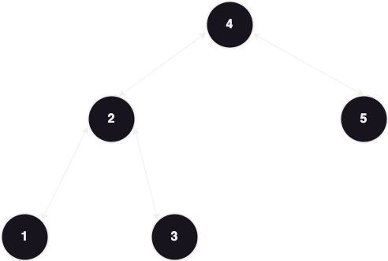
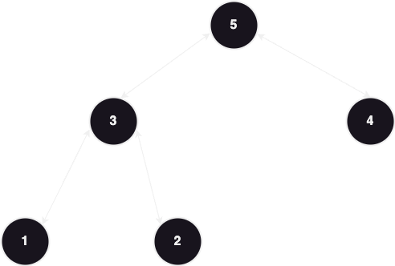

# DFS
#### Traversal types are:
### A)Pre Order Traversal

#### Node -> left -> right
```java
 void preOrder(Node node){
        if(node == null){
            return;
        }
        System.out.println(node.value);
        preOrder(node.left);
        preOrder(node.right);
    }
```

### B)In Order Traversal

#### left -> Node -> right
```java
 void inOrder(Node node){
        if(node == null){
            return;
        }       
        inOrder(node.left);
        System.out.println(node.value);
        inOrder(node.right);
    }
```


### C)Post Order Traversal

#### left -> right -> Node
```java
 void postOrder(Node node){
        if(node == null){
            return;
        }
        postOrder(node.left);
        postOrder(node.right);
        System.out.println(node.value);
    }
```