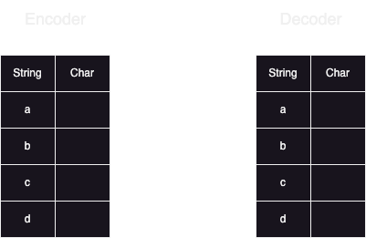
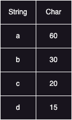
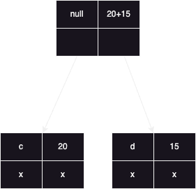
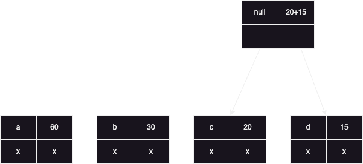
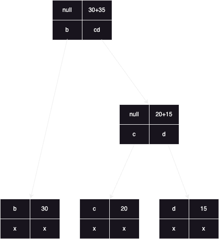
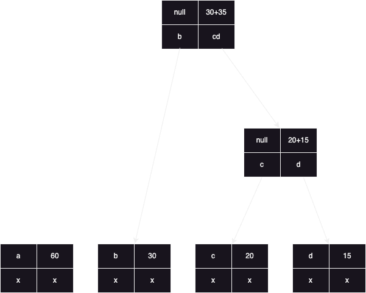
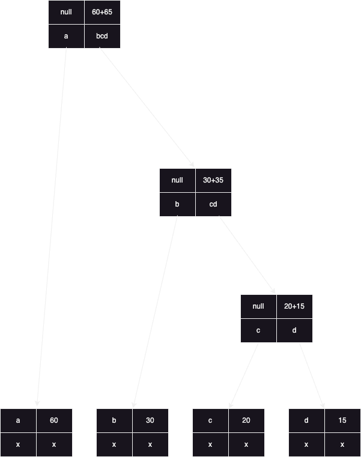
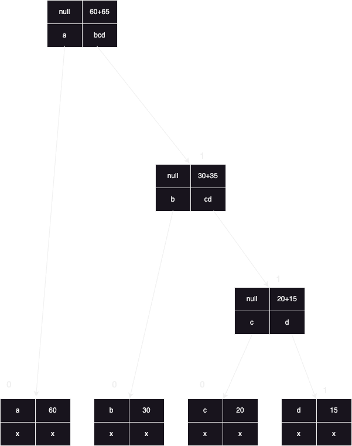
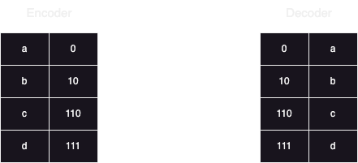

# Huffman Coding

### what is it ? it's a lossless algorithm (no lost data) compression algorithm
#### let's say you have a string a = "aabcdag" each character's space is 2 bytes, then total space is 7 * 2 = 14 bytes or 7 * 2 * 8 = 112 bits
### compressoion means we store the same string in a less amount of bits
### how to accomplish this ?  using huffman coding
### we also use hashmaps here 

## Steps to perform huffman algorithm :

### 1. Pass the string (aka feeder, data)

### 2. Make frequency map

#### a is coming 60m times
#### b is coming 30 times ...etc

### 3. For every key in the frequency map, create a Node and insert this node in a minHeap/ priority queue.
#### Node data: char data, int cost -> frequency, Node left, Node right

### 4. Keep Removing 2 elements from heap and combine
#### c and d removed:

#### here updated heap will be:

#### b and c,d removed:

#### here updated heap will be:

#### a and bcd removed:

### 5. In the final heap add 0 when you move left and add 1 when you move right

### 6. Make the path for every character and fill the encoder and decoder

### 7. To encode / decode 
#### a  b  b  c   c   d  a -> 112 bits
#### 0 10 10 110 110 111 0 -> 15 bits

## Time complexity: O(N)
## Space complexity: O(N logN)