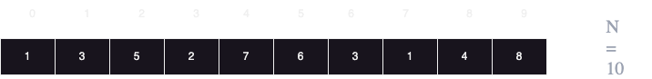
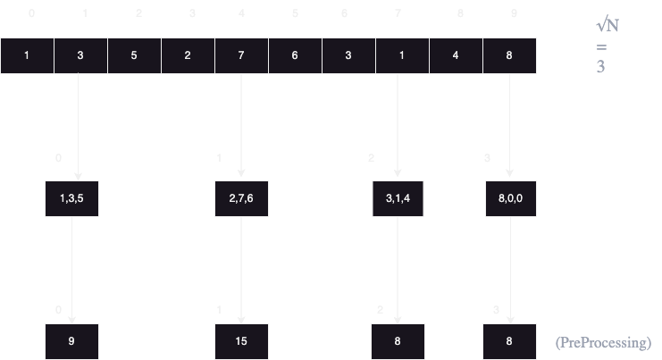

# Square Root decmoposition for Range Query problems

### let's say you have this array

### And you want to find the sum of items from index 2 till 6
### Brute force approach will be making a for loop and run it n times so time will be O(N)
### How to solve it in faster time ?
### Using square root decomposition Algorithm it can be done in O(√N)
## Algorithm:
### 1. Divide the array into blocks of size √N
### 2. Compute answer for every block
### 3. Given a query for L to R Combine the blocks that contain these

### here we have three cases:
### A) we have full chunks, eg: we want indices from 3 -> 8, here we take entire blocks 1,2
### B) we have a whole chunck and part of others, eg: we want indices from 2 -> 5, here we take 1/3 of chunck 0 and whole chunk 1
### The idea here that the part outside the chunk will never be greater than √N for it's a part of othetr chunck 

### Note: if you want to change something in the original array you have to also chnage it in the chuncks array by adding the diffrence between the new item and the item already existing in the place you want to put it in.