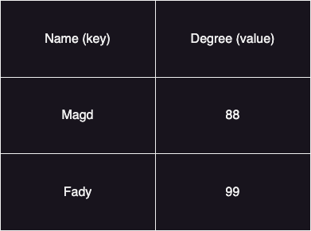
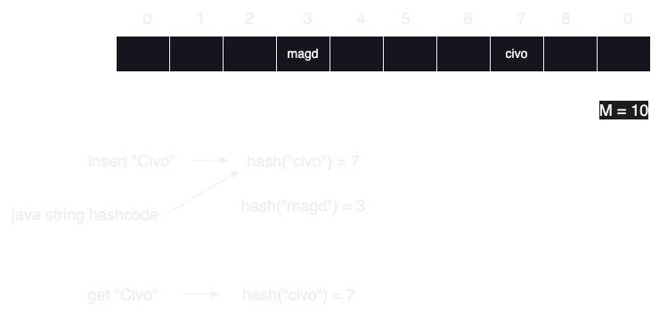
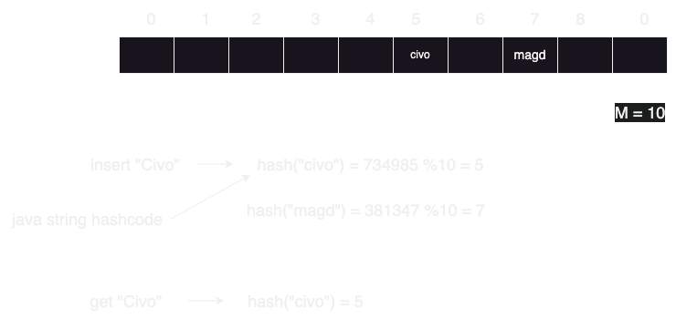
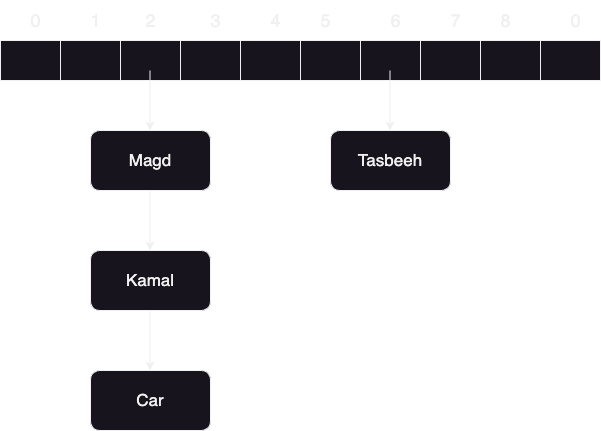
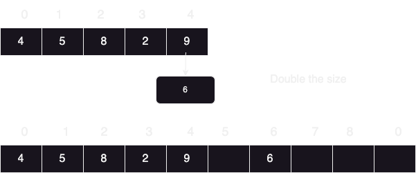
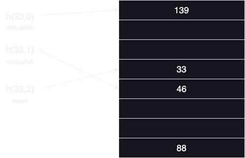
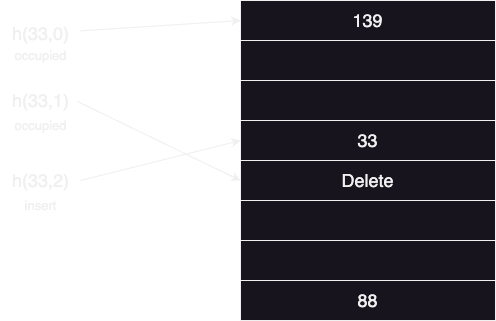
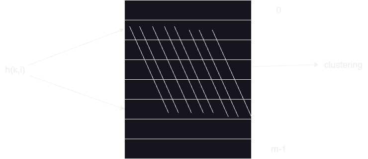

# HashMaps

### Problem statement: we know in binary search tree we can get an element in O(log N), but what if we want to get an element in 0(1) time? the answer is HashMaps

### Structure: key value pairs

### map.get("Magd") => 88 (done in O(1)) , but how? using hashcode

### Hashcode:
#### 1) we need all elments as positive numbers (hashCode function)
#### 2) the hashcode we get can be very large, we have to reduce it (hashing) => reduce all elements in table to size m
### Example:

### The problem here is it's not a single number like 7 and 3 it's a much bigger number and we want the number to be less than 10, A solution can be is to take remainder wih 10

### What if two items have the same modulo with 10, this is called (Collisions)
### how to deal with Collisions:
## A) Chaining:
##### means that every item in the array is a linked list in it's self

### The worst case here might be that all items has the same end value and fall on the same list, here we will have to traverse in O(N), so we have to try our best to make sure that not all items fall in the same linked list using something called (Simple Uniform Hashing).
### So we make an assumption that every key is equally likely to be hashed to any solt in the table independent to all the previous keys are hashed
### Example : n = total number of keys in the table , m = size of the table 
### Then load factor (expected number of keys for each slot) = α = n/m , so the time complexity will be O(1 + α) , so if α(alpha) is O(1) so total time will be O(1) and this happens when the size of the table (m) is Ω(n)
### We use hash functions to achieve this like:
### 1) Division Method: h(k) = k % m 
#### M can be: 
#### size of the array -> not much random,
#### A prime number -> not to close to the power of 2 or 10 which are common in the real world (better than the size of the array).
### 2) Multiplication Method: h(k) = [(a.k) % 2 w] >> (w-r)
#### where a is a random number
#### w is the number of bits in k 
#### m = 2r
### Note: this is practical when:
#### a is an odd number and
#### 2w-1 < a < 2w
#### a is not too close to 2w-1 or 2w
### 3) Universal Hashing: h(k) = [(ak+b) % p] % m
#### a and b are random numbers that belong to [0,1,2,...., p-1]
#### p is a large prime number
### Here the probability that [h(k1) = h(k2)] = 1/m
# 
### But how large should m(size of the table should be)?
### It should always be Θ(N)
### For the more it gets small the table will be slow and the more it gets big the more it wastes resources
### The idea is start small and then grow

#### here if when n = m we make:
#### m = m+1 => will be inserting N items in O(N2)
#### m = m*2 => will be inserting N items in O(N), inserting 1 item in O(1) -> ammortized constant time
#### similarly we if the array size (m) becomes n/2, we shrink the array by m/2, but this will be O(N) for operation
#### so an alternative can be n = m/4, half the size , this will be done in  O(1) -> ammortized constant time

## B) Open Adressing:
### only one item per slot m >= n
### It will start probing(trying) to insert

### if the item is already occupied, we look for the next possible item
### here we have 139 -> 46 -> 33
### what if we want to delete 46? 
### we cannot make the adress empty, we make a delete note(flag) in the adress

### so it becomes 139 -> Delete -> 33
### But how will it look for other indexes?
### Probing startegies:
### 1) Linear Probing: h(k,i) = ( h(k) + i ) % m

### the problem here is you might form a cluster (not all the space is utilized) to minimize clustering:
### 2) Double Hashing: h(k,i) = ( h1(k) + i* h2(k) ) % m
### When a collision occurs, the hash function uses a second, independent hash function to calculate the probe sequence. This ensures that the probes are spread more uniformly across the table, reducing clustering.
###	h1(k) is the primary hash function.
###	h2(k) is the secondary hash function, which ensures that the probing steps are not constant.
###	i is the probe count.
###	m is the size of the hash table.
# 
## When to use chaining and when to use open adressing?
### Open Adressing -> better cache performance (pointers are not needed)
### Chaining -> less sensitive to hash functions