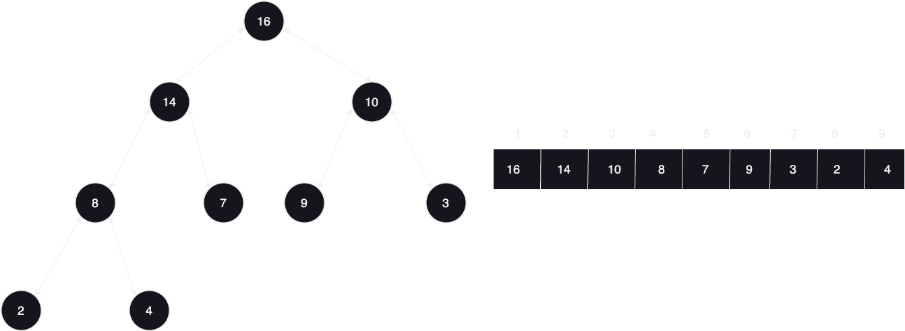

# Heaps

#### Problem statement: let's say you want to store items in data structure based on a certain criteria like numbers from smallest to greatest to get the smallest or the greatest in O(1) time, so you use and array to store the numbers, the problem here is in every insertion you have to sort the array so insertion takes O(N logN) time, then how to make insertion take O(LogN) time? the answer is using Heaps.

### how heaps work:
#### heaps are stored in an array, but the are represented as a tree:

### Properties:
### 1) Complete Binary tree
### 2) Array May not be sorted but Every Node value is >= all of it's children
### 3) Tree Structure: 
#### A)root => (i = 1) which is the smallest, greatest item (whatever criteria)
#### B) parent(i) = i/2
#### C) left(i) = 2\*i
#### D) right(i) = (2\*i)+1
#### E) height = log(N)

### inserting items in a heap:
#### insert at last and keep checking the criteria with parent and keep swapping with parent untill you meet the criteria, so it will be done in  O(LogN) time, this is called upheap method.

### removing element from heap:
#### take the last element and replace it with the item you want to remove and remove it,then keep comparing the item with the criteria with left and right children and keep swapping if the criteria is met with the item that meets the criteria more from left and right.

### creating a heap from an unsorted array:

#### we have this array and want to make it a maxHeap which means that every node should be greater than it's children, which means we can skip all the leaf nodes for they have no children, and we know that in a complete binary tree leaf nodes are n/2 so all we care about are nodes from the start till n/2 and we will do a downheap for each node of these