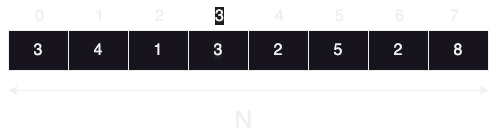
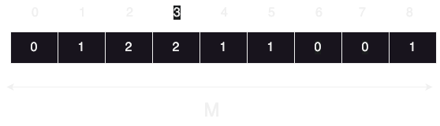
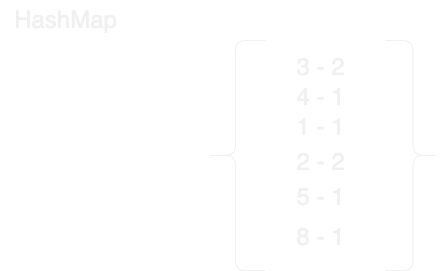

# Count Sort Algorithm

## it's a non-comparison sorting algorithm, that's good for smaller numbers

### let's say you want to sort this array, with size => N:

### 1) Get the largest element in the array => 8
### 2) Create a frequency array with the largest element size + 1 => M, that contains every item's frequency

### 3) Replace the original array with the correct values form the frequency array
### Time and Space will both be O(N+M)
### Instead of saving the values in an array you also might use a hashMap to save the frequency Array
