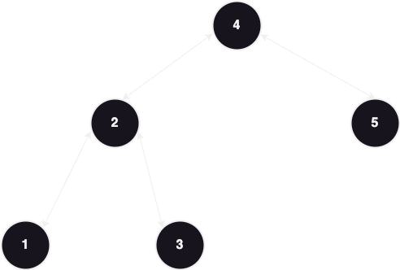
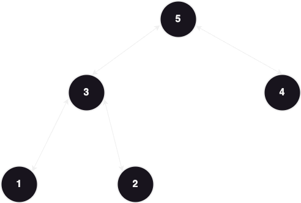

# DFS

#### Traversal types are:

### A)Pre Order Traversal

#### Node -> left -> right
```java
 void preOrder(Node node){
        if(node == null){
            return;
        }
        System.out.println(node.value);
        preOrder(node.left);
        preOrder(node.right);
    }
```
#### Usages:
##### When you want to visit the root first and do something then move L -> R
#
### B)In Order Traversal

#### left -> Node -> right
```java
 void inOrder(Node node){
        if(node == null){
            return;
        }       
        inOrder(node.left);
        System.out.println(node.value);
        inOrder(node.right);
    }
```
#### Usages:
##### In a Binary Search Tree when you want a lower or the lowest value
#
### C)Post Order Traversal

#### left -> right -> Node
```java
 void postOrder(Node node){
        if(node == null){
            return;
        }
        postOrder(node.left);
        postOrder(node.right);
        System.out.println(node.value);
    }
```
#### Usages:
##### when you want to delete a tree (for you reach the root in the end)
#
## Given this problem:
## 543 Diameter of a binary tree 
### The diameter of a binary tree is the length of the longest path between any two nodes in a tree. This path may or may not pass through the root.
### Example

### Input: root = [1,2,3,4,5]
### Output: 3
### Explanation: 3 is the length of the path [4,2,1,3] or [5,2,1,3].

#### Solution:
#### Diameter of every Node you pass by is LeftHeight + rightHeight + 1
#### we pass by all nodes to get all diameters in post order traversal
#### so in every node we pass by we compare it's diameter with the value saved in diameter if it's greater we save it 
#### in the end the value of the diameter will be greater than the answer we need by one for we need the path not the number of nodes se we return diameter - 1
```java
/**
 * Definition for a binary tree node.
 * public class TreeNode {
 *     int val;
 *     TreeNode left;
 *     TreeNode right;
 *     TreeNode() {}
 *     TreeNode(int val) { this.val = val; }
 *     TreeNode(int val, TreeNode left, TreeNode right) {
 *         this.val = val;
 *         this.left = left;
 *         this.right = right;
 *     }
 * }
 */
class Solution {
    int diameter = 0;
    public int diameterOfBinaryTree(TreeNode root) {
        height(root);
        return diameter-1;
    }
    int height(TreeNode root){
        if(root == null){
            return 0;
        }
        int leftHeight = height(root.left);
        int rightHeight = height(root.right);

        int dia = leftHeight + rightHeight +1;
        diameter = Math.max(diameter , dia);
        
        return Math.max(leftHeight, rightHeight)+1;
    }
}
```
## So the key to solving DFS problems is to find which type of traversal is being used
