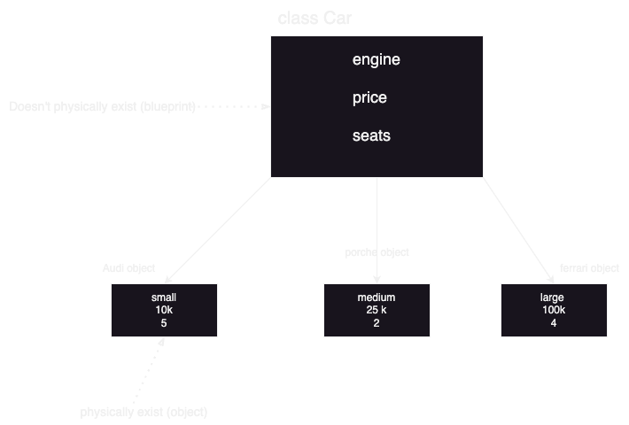
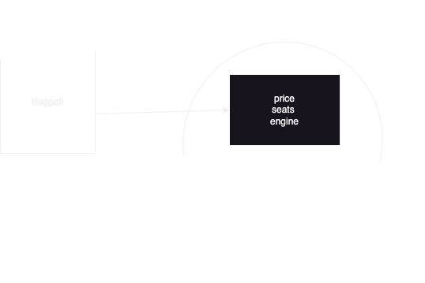

# OOP

## 1) A class is a group of properties and functions, which is a blueprint for objects. 


## 2) Object is an intance (physical represntstion) of a class 

## 3) . operator is the way to access instance variable of the object.
#### example:
```java
System.out.println(porche.price);
//                     25k
```
```java
class Car{
    int price;
    int seats;
    Engine engine;
}

Car bugatti;
```
#### here bugatti doesn't refer to an actual object, it's just in the stack memory pointing to null.


#### to have it point to an object we initialize it this way:
```java 
    bugatti      =    new Car();
//compile time          runtime
//new keyword: dynamically allocates memory and returns a reference to it
```


## 4) A constructor defines what happens when the object is created, it's a special function that runs when you create an object and it allocates variables.
```java
Car bugatti = new Car(mid,30k,5);
```
#### here the constructor binds these arguments with the object.

## 5) this keyword gets replaced with the object when the constructor gets called.
#### it might also be used for calling a constructot from another one.

