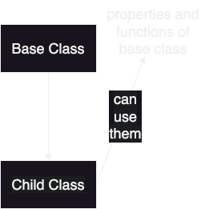
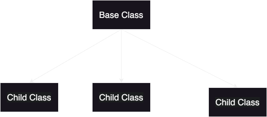

# OOP

## 1) A class: is a group of properties and functions, which is a blueprint for objects. 


## 2) Object is an intance (physical represntstion) of a class 

## 3) . operator: is the way to access instance variable of the object.
#### example:
```java
System.out.println(porche.price);
//                     25k
```
```java
class Car{
    int price;
    int seats;
    Engine engine;
}

Car bugatti;
```
#### here bugatti doesn't refer to an actual object, it's just in the stack memory pointing to null.


#### to have it point to an object we initialize it this way:
```java 
    bugatti      =    new Car();
//compile time          runtime
//new keyword: dynamically allocates memory and returns a reference to it
```


## 4) A constructor: defines what happens when the object is created, it's a special function that runs when you create an object and it allocates variables.
```java
Car bugatti = new Car(mid,30k,5);
```
#### here the constructor binds these arguments with the object.

## 5) this keyword: gets replaced with the object when the constructor gets called.
#### it might also be used for calling a constructot from another one.

## 6)final keyword: guarantees immutability for the value on:
### A) primitive data types:
```java
final int increase = 2;
increase = 3; // compile time error
```
### B) objects:
```java
final Car bugatti = new Car();
bugatti.price = 40k; // no error
bugatti = otherObject; //compile time error
```
### Note: when a non primitive is final you cannot re-assign it

## 7) packages: containers for classes (folders)
### eg: com.magd -> only magd folder exists in com folder(append to name), if com had more files none of them will append to name:
#### 📁 com
#### - 📁 magd
#### - 📁 kamal 
### what if i want to create two classes with the same name in the same (package) folder ?
### I'll have to create a package for every one, so here in a class in magd folder we find:
```java
package com.magd;
```

## 8) import statement; used to access public methods and properties outside the package, if any statement inside the package import is not needed.

## 9)static: used to make a variable or method the same for all instances and not dependent on object
```java
class Human{
    int age;
    String name;
    static long population; // Here population will be the same value for all instances
    public Human(int, age,String name){
        this.age = age;
        this.name = name;
        Human.population+=1;
    }
}

Human magd = new Human(23,"Magd");
Human kamal = new Human(59,"Kamal");
System.out.println(magd.population); // 2
System.out.println(tasbeeh.population); // 2 
// if it was not static it would print 1 both times for it's not dependent on instance, so the convetion is to make it this way:
System.out.println(Human.population); // for it's the same for all instances and you can use it even without creating an object
```
### static methods cannot call not-static ones for not-static ones belong to an instance
```java
 static void fun(){
  greeting(); // Error
 }
 void greeting(){}
 // to make it work give it an object:
static void fun(){
Main obj = new Main();
obj.greeting();// No Error
}
```
### you cannot use this keyword in a static method for it refers to the object

## 10)Static Bloc: used to initialize static variables and gets executed once when the class is first loaded
```java
class StaticBlock{
    static int a =4;
    static int b;

    static{
        // this will only run once when the first object is created only , so when you create new objects it will not run again
      System.out.println("I'm in a static block");
      b = a * 5;
    }
}
```

## 11) Inner classes: classes inside other classes and dependent on them.
### inner classes only can be static outer cannot
### an object of non-static class cannot be created in a static method, for the the inner class depends on the main one.

## 12) Singleton class: a class that you can only create one object of it.
### it's constructor is private, and has one instance variable inside it, and a get instance metohd that creates the instance using the constructor only if instance variable is null, and it's returning the same instance variable every time.

## 13) Inheritance: a child class can inherit functions and properties from the base class (except the private ones)

## and the child class has it's own properties and functions that are not accessible for the base class

## 14) Extends keyword: used with child class in this manner: class ChildClass Extends BaseClass{}
```java
// Base class
class BaseClass {
    String baseProperty = "I am a property of the Base Class";

    void baseMethod() {
        System.out.println("This is a method from the Base Class");
    }
}

// Child class
class ChildClass extends BaseClass {
    String childProperty = "I am a property of the Child Class";

    void childMethod() {
        System.out.println("This is a method from the Child Class");
    }
}

// Main class to test inheritance
public class InheritanceExample {
    public static void main(String[] args) {
        // Create an object of the ChildClass
        ChildClass child = new ChildClass();

        // Access base class properties and methods
        System.out.println(child.baseProperty);
        child.baseMethod();

        // Access child class properties and methods
        System.out.println(child.childProperty);
        child.childMethod();
    }
}
```
### Note: the refernce variable is what determines what the object is able to access not the object type
```java
// Base class
class BaseClass {
    String baseProperty = "Base class property";

    void baseMethod() {
        System.out.println("Base class method");
    }
}

// Child class
class ChildClass extends BaseClass {
    String childProperty = "Child class property";

    void childMethod() {
        System.out.println("Child class method");
    }
}

// Main class to test base class reference with child object
public class BaseReferenceExample {
    public static void main(String[] args) {
        // Base class reference pointing to a Child class object
        BaseClass obj = new ChildClass();

        // Accessing properties and methods
        System.out.println(obj.baseProperty); // Can access base class property
        obj.baseMethod(); // Can access base class method

        // The following will cause an error as they are specific to ChildClass
        // System.out.println(obj.childProperty);
        // obj.childMethod();
    }
}
```
### here the reference variable is of type base class so it cannot access child class variables
### Also if the reference variable is of type child class and tries to reference to a constructor of type parent it cannot for the parent has no access to child properties
```java
// Base class
class BaseClass {
    void baseMethod() {
        System.out.println("Base class method");
    }
}

// Child class
class ChildClass extends BaseClass {
    void childMethod() {
        System.out.println("Child class method");
    }
}

// Main class to test invalid assignment
public class InvalidReferenceExample {
    public static void main(String[] args) {
        // This will cause a compilation error
        // ChildClass obj = new BaseClass();
    }
}
```
## 15)super constructor: the superclass constructor for value that subclass takes from superclass
```java
// Superclass
class BaseClass {
    String name;

    // Constructor of the superclass
    BaseClass(String name) {
        this.name = name;
        System.out.println("BaseClass Constructor: Name is " + name);
    }
}

// Subclass
class ChildClass extends BaseClass {
    int age;

    // Constructor of the subclass
    ChildClass(String name, int age) {
        super(name); // Calling the superclass constructor
        this.age = age;
        System.out.println("ChildClass Constructor: Age is " + age);
    }
}

// Main class to test the super constructor
public class SuperConstructorExample {
    public static void main(String[] args) {
        // Create an object of the ChildClass
        ChildClass child = new ChildClass("John", 25);
    }
}
```
### Note: if you use super in a class that is no child to any other class it will refer to the main Object class from which every other class is inherited, for calling super refers to the class above the class we're in.

## 16) Single inheritance: one class extends anothe class.

## 17) Multiple inheritance: A class extends more than one class.

### what if a value with the same name at the two parent classes and you try to acess it from the child object what will be the output ?
### that's why multiple inheritence is not supported in java, An elternative here can be (intefaces).

## 18) Hierarcial inheritance: one class is inherited by many classes.


## 19) Hybrid ingeritance: A combination between single and multiple inhertance (not supported in java) for multiple inheritance isn't, An elternative here can be (intefaces) too.

## 20) Polymorphism: one action behaving differently depending on the context.
```java
class Shape {
    void draw() {
        System.out.println("Drawing a shape");
    }
}

class Circle extends Shape {
    void draw() {
        System.out.println("Drawing a circle");
    }
}

class Square extends Shape {
    void draw() {
        System.out.println("Drawing a square");
    }
}

public class Main {
    public static void main(String[] args) {
        Shape shape1 = new Circle(); // Circle object as Shape type
        Shape shape2 = new Square(); // Square object as Shape type

        shape1.draw(); // Calls Circle's draw method
        shape2.draw(); // Calls Square's draw method
    }
}
```

## 21) Compile time (static) Polymorphism: acieved via method overloading, it's calles compile time polymorphism for java determines what function gets called in compile time.
```java
public class PolymorphismExample {
    
    // Method with no parameters
    public void display() {
        System.out.println("Display method with no parameters.");
    }
    
    // Method with one integer parameter
    public void display(int number) {
        System.out.println("Display method with one parameter: " + number);
    }
    
    // Method with two parameters
    public void display(int number, String text) {
        System.out.println("Display method with two parameters: " + number + ", " + text);
    }
    
    // Method with different data type parameter
    public void display(String text) {
        System.out.println("Display method with one string parameter: " + text);
    }

    public static void main(String[] args) {
        PolymorphismExample example = new PolymorphismExample();
        
        // Call the method with different parameter lists
        example.display();
        example.display(10);
        example.display(25, "Hello");
        example.display("Overloaded Method");
    }
}
```

## 22) Runtime (dynamic) polymorphism: achieved by method overriding, it's calles Run-time polymorphism for java determines what function gets called in Run-time.
```java
 class Animal {
    // Base class method
    public void sound() {
        System.out.println("Animal makes a sound");
    }
}

class Dog extends Animal {
    // Overriding the sound method
    @Override
    public void sound() {
        System.out.println("Dog barks");
    }
}

class Cat extends Animal {
    // Overriding the sound method
    @Override //this override annotation is used to figure out if the function is overroding some other one (it's made using intefaces) 
    public void sound() {
        System.out.println("Cat meows");
    }
}

public class RuntimePolymorphismExample {
    public static void main(String[] args) {
        // Parent class reference, assigned child class object
        Animal myAnimal;

        // Reference points to a Dog object
        myAnimal = new Dog();
        myAnimal.sound(); // Output: Dog barks

        // Reference points to a Cat object
        myAnimal = new Cat();
        myAnimal.sound(); // Output: Cat meows
    }
}
```
## 23) Overriding: a feature that allows a subclass to provide a specific implementation for a method that is already defined in its parent class.
```java
Parent obj = new Child();
// here the called method depends on the constructor and this is called "Upcasting" which is how overriding works, 
// and java determines this using something called dynamic method dispatch, that's why it's called dynamic polymorphism.
``` 
### Note: you can use final keyword to prevent overriding
```java
class Parent {
    // Final method - cannot be overridden
    public final void display() {
        System.out.println("This is a final method in the parent class.");
    }
}

class Child extends Parent {
    // Attempting to override will result in a compilation error
    /*
    @Override
    public void display() {
        System.out.println("Trying to override a final method."); // Error
    }
    */
}

public class FinalMethodExample {
    public static void main(String[] args) {
        Parent parent = new Parent();
        parent.display(); // Output: This is a final method in the parent class.

        Child child = new Child();
        child.display(); // Output: This is a final method in the parent class.
    }
}
```
### Note: you can also use the final keyword to prevent inheritance
```java
// Final class - cannot be extended
final class Parent {
    public void display() {
        System.out.println("This is a final class and cannot be inherited.");
    }
}

// Attempting to extend the final class will cause a compilation error
/*
class Child extends Parent { // Error: Cannot inherit from final 'Parent'
    public void display() {
        System.out.println("Trying to inherit a final class."); // Error
    }
}
*/

public class FinalClassExample {
    public static void main(String[] args) {
        Parent parent = new Parent();
        parent.display(); // Output: This is a final class and cannot be inherited.
    }
}
```

### Note: static methods cannot be overriden but can be inherited
```java
class Parent {
    // Static method in the parent class
    public static void display() {
        System.out.println("Static method in the parent class.");
    }
}

class Child extends Parent {
    // Static method with the same name in the child class (method hiding)
    public static void display() {
        System.out.println("Static method in the child class (method hiding).");
    }
}

public class StaticMethodExample {
    public static void main(String[] args) {
        // Call using Parent reference
        Parent.display(); // Output: Static method in the parent class.

        // Call using Child reference
        Child.display(); // Output: Static method in the child class (method hiding).

        // Parent reference pointing to Child object
        Parent parent = new Child();
        parent.display(); // Output: Static method in the parent class.
    }
}
```

## 24) Encapsulation: wrapping up the implementation of the data members and methods in a class.
```java
class Person {
    // Private data members (data hiding)
    private String name;
    private int age;

    // Public getter method for name
    public String getName() {
        return name;
    }

    // Public setter method for name
    public void setName(String name) {
        this.name = name;
    }

    // Public getter method for age
    public int getAge() {
        return age;
    }

    // Public setter method for age
    public void setAge(int age) {
        if (age > 0) { // Validation to ensure age is valid
            this.age = age;
        } else {
            System.out.println("Age must be positive.");
        }
    }
}

public class EncapsulationExample {
    public static void main(String[] args) {
        Person person = new Person();

        // Using setter methods to set values
        person.setName("Alice");
        person.setAge(25);

        // Using getter methods to access values
        System.out.println("Name: " + person.getName()); // Output: Name: Alice
        System.out.println("Age: " + person.getAge());   // Output: Age: 25

        // Attempting to set an invalid age
        person.setAge(-5); // Output: Age must be positive.
    }
}
```
## 25) Abstraction: hiding the unneccessary details and showing only the valuable information.
```java
// Abstract classes: Classes with the abstract keyword, 
// which can have abstract (unimplemented) methods and non-abstract (implemented) methods.
abstract class Animal {
    // Abstract method (no implementation)
    public abstract void sound();

    // Non-abstract method (implemented)
    public void sleep() {
        System.out.println("This animal sleeps.");
    }
}

// Concrete subclass
class Dog extends Animal {
    // Implementing the abstract method
    @Override
    public void sound() {
        System.out.println("Dog barks.");
    }
}

public class AbstractClassExample {
    public static void main(String[] args) {
        // Cannot instantiate an abstract class
        // Animal animal = new Animal(); // Error

        Animal dog = new Dog();
        dog.sound(); // Output: Dog barks.
        dog.sleep(); // Output: This animal sleeps.
    }
}
```

### Comparison between abstraction and encapsulation.

| **Feature**            | **Abstraction**                              | **Encapsulation**                           |
|------------------------|----------------------------------------------|---------------------------------------------|
| **Definition**          | Hiding implementation details and showing only essential features. | Wrapping data and methods in a class to restrict access. |
| **Focus**               | Focuses on the **what** of an object.        | Focuses on the **how** of protecting the data. |
| **Achieved By**         | Abstract classes and interfaces.             | Private fields and public getters/setters.  |

## 26) Acess modifiers: are keywords used to set the visibility and accessibility of classes, methods, constructors, and variables. 
### Comparision between all access modifiers:
                │ Class │ Package │ Subclass │ Subclass │ World
                │       │         │(same pkg)│(diff pkg)│(diff pkg & not subclass)
    ────────────┼───────┼─────────┼──────────┼──────────┼──────────────────────────
    public      │   +   │    +    │    +     │     +    │   +
    ────────────┼───────┼─────────┼──────────┼──────────┼──────────────────────────
    protected   │   +   │    +    │    +     │     +    │
    ────────────┼───────┼─────────┼──────────┼──────────┼──────────────────────────
    no modifier │   +   │    +    │    +     │          │
    ────────────┼───────┼─────────┼──────────┼──────────┼──────────────────────────
    private     │   +   │         │          │          │

## 27) Object class: is the topmost class in Java’s class hierarchy and serves as the root of the inheritance hierarchy.

### Note: if java doesn't support multiple inheritance how may a class inherit another class and object class at the same time ?
### Java supports single inheritance of classes but allows multiple inheritance of types through interfaces. Every class in Java implicitly inherits from the Object class unless it explicitly extends another class. Here’s how this works:
### A) If a class does not extend any other class, it implicitly extends the Object class.
```java
class A {
    // Inherits methods like toString(), hashCode(), equals() from Object
}
```
### B) If a class extends another class, the Object class is part of the inheritance chain:
```java
class B extends A {
    // B inherits A's methods and Object's methods through A
}
```
### Java’s single inheritance rule ensures that a class can only explicitly extend one class at a time. The Object class is automatically placed at the top of the hierarchy, so it doesn’t need to be explicitly extended.
```java
class A {
    void display() {
        System.out.println("A's method");
    }
}

class B extends A {
    void show() {
        System.out.println("B's method");
    }
}

public class Main {
    public static void main(String[] args) {
        B obj = new B();
        obj.display(); // Inherited from A
        obj.toString(); // Inherited from Object
    }
}
```

## 28) Object class Methods:

### A) toString()
### Signature: public String toString()
###	Description: Returns a string representation of the object.
###	Default Behavior: Returns a string in the format ClassName@HexHashCode.
###	Usage: Often overridden in custom classes to provide meaningful string representations.
```java
class Example {
    int value;
    Example(int value) {
        this.value = value;
    }

    @Override
    public String toString() {
        return "Example[value=" + value + "]";
    }
}

public class Main {
    public static void main(String[] args) {
        Example obj = new Example(42);
        System.out.println(obj); // Output: Example[value=42]
    }
}
```
### B) hashCode()
### Signature: public int hashCode()
###	Description: Returns an integer hash code for the object.
###	Default Behavior: Provides a hash code based on the object’s memory address.
###	Usage: Commonly used in hash-based collections like HashMap and HashSet.

### C) equals()
###	Signature: public boolean equals(Object obj)
###	Description: Compares this object to the specified object for equality.
###	Default Behavior: Compares references (returns true if both refer to the same object).
###	Usage: Override this method to compare object contents for logical equality.
```java
class Example {
    int value;

    Example(int value) {
        this.value = value;
    }

    @Override
    public boolean equals(Object obj) {
        if (this == obj) return true;
        if (obj == null || getClass() != obj.getClass()) return false;
        Example example = (Example) obj;
        return value == example.value;
    }
}

public class Main {
    public static void main(String[] args) {
        Example obj1 = new Example(42);
        Example obj2 = new Example(42);
        System.out.println(obj1.equals(obj2)); // Output: true
    }
}
```

### D) getClass()
### Signature: public final Class<?> getClass()
###	Description: Returns the runtime class of the object.
### Usage: Useful for reflection or identifying the object’s class at runtime.
```java
public class Main {
    public static void main(String[] args) {
        String str = "Hello";
        System.out.println(str.getClass().getName()); // Output: java.lang.String
    }
}
```

### E) clone()
### Signature: protected Object clone() throws CloneNotSupportedException
###	Description: Creates and returns a copy of the object.
###	Default Behavior: Performs a shallow copy of the object.
###	Usage: Must implement Cloneable interface and override the method to enable cloning.
```java
class Example implements Cloneable {
    int value;

    Example(int value) {
        this.value = value;
    }

    @Override
    protected Object clone() throws CloneNotSupportedException {
        return super.clone();
    }
}

public class Main {
    public static void main(String[] args) throws CloneNotSupportedException {
        Example obj = new Example(42);
        Example clonedObj = (Example) obj.clone();
        System.out.println(clonedObj.value); // Output: 42
    }
}
```

### F) finalize()
###	Signature: protected void finalize() throws Throwable
###	Description: Called by the garbage collector before reclaiming the object’s memory.
###	Usage: Rarely used; typically avoided in favor of explicit resource management.
### Note: As of Java 9, the finalize method is deprecated.

### G) wait() (Overloaded)
### Signatures:
###	public final void wait() throws InterruptedException
###	public final void wait(long timeout) throws InterruptedException
###	public final void wait(long timeout, int nanos) throws InterruptedException
###	Description: Causes the current thread to wait until another thread invokes notify() or notifyAll() on the same object.
###	Usage: Used in multithreading for inter-thread communication.

### H) notify()
### Signature: public final void notify()
### Description: Wakes up a single thread that is waiting on this object’s monitor.

### I) notifyAll()
###	Signature: public final void notifyAll()
###	Description: Wakes up all threads that are waiting on this object’s monitor.

## 29) Abstract class: is a class that is declared with the keyword abstract. It is a blueprint for other classes and cannot be instantiated directly. Abstract classes are designed to be extended by subclasses, which then implement or override the abstract methods defined in the abstract class.
```java
// Abstract class
abstract class Animal {
    // Abstract method (must be implemented by subclasses)
    abstract void makeSound();

    // Concrete method
    void eat() {
        System.out.println("This animal eats food.");
    }
}

// Subclass
class Dog extends Animal {
    // Implement the abstract method
    @Override
    void makeSound() {
        System.out.println("Woof Woof!");
    }
}

public class Main {
    public static void main(String[] args) {
        // Animal a = new Animal(); // Error: Cannot instantiate an abstract class

        Animal dog = new Dog(); // Polymorphism
        dog.makeSound(); // Output: Woof Woof!
        dog.eat();       // Output: This animal eats food.
    }
}
```

## 30) Interface: is a blueprint for a class that specifies a set of methods that the implementing class must define. Interfaces provide a way to achieve abstraction and multiple inheritance in Java.
```java
// Interface
interface Animal {
    void makeSound(); // Abstract method
    default void eat() { // Default method
        System.out.println("This animal eats food.");
    }
    static void info() { // Static method
        System.out.println("Animal interface");
    }
}

// Class implementing the interface
class Dog implements Animal {
    @Override
    public void makeSound() {
        System.out.println("Woof Woof!");
    }
}

public class Main {
    public static void main(String[] args) {
        Dog dog = new Dog();
        dog.makeSound(); // Output: Woof Woof!
        dog.eat();       // Output: This animal eats food.
        Animal.info();   // Output: Animal interface
    }
}
```

### Note: Differences Between Abstract Classes and Interfaces

| Feature                  | Abstract Class                         | Interface                           |
|--------------------------|-----------------------------------------|-------------------------------------|
| **Keyword**              | `abstract`                             | `interface`                        |
| **Methods**              | Can have abstract and concrete methods | Can have abstract, default, static, and private methods |
| **Fields**               | Can have instance variables            | Can have only `public static final` constants |
| **Inheritance**          | Single inheritance                     | Multiple inheritance (via `implements`) |
| **Constructors**         | Can have constructors                  | Cannot have constructors            |