# Trees Problems
#
## 1) BFS Problems
#
### // TODO: continue here
### 993 cousins in a binary tree
#### A) First we need to find both nodes that we want to compare using the findNode() method
#### B) Then we compare their level using level() method which returns the level of the node as integer
#### C) If they are at the same level they also must not be siblings which we check using isSiblings() method
```java
/**
 * Definition for a binary tree node.
 * public class TreeNode {
 *     int val;
 *     TreeNode left;
 *     TreeNode right;
 *     TreeNode() {}
 *     TreeNode(int val) { this.val = val; }
 *     TreeNode(int val, TreeNode left, TreeNode right) {
 *         this.val = val;
 *         this.left = left;
 *         this.right = right;
 *     }
 * }
 */
class Solution {
    public boolean isCousins(TreeNode root, int x, int y) {
        TreeNode xx = findNode(root,x);
        TreeNode yy = findNode(root,y);

        return (level(root,xx,0) == level(root,yy,0) && (!isSiblings(root,xx,yy)));
    }
    TreeNode findNode(TreeNode node , int value){
        if(node == null){
            return null;
        }
        if(node.val == value){
            return node;
        }
        TreeNode n = findNode(node.left,value);
        if(n!= null){
            return n;
        }
        return findNode(node.right,value);
    }

    boolean isSiblings(TreeNode node , TreeNode x, TreeNode y){
        if(node == null){
            return false;
        }
        return (node.left == x && node.right == y) || (node.left == y && node.right == x) || isSiblings(node.left,x,y) ||  isSiblings(node.right,x,y);
    
    }

    int level(TreeNode node , TreeNode x, int level){
        if(node == null){
            return 0;
        }
        if(node ==x){
            return level;
        }
        int l = level(node.left,x,level+1);
        if(l!= 0){
            return l;
        }
        return level(node.right,x,level+1);
    }
}
```
#
### 101 Symmetric tree

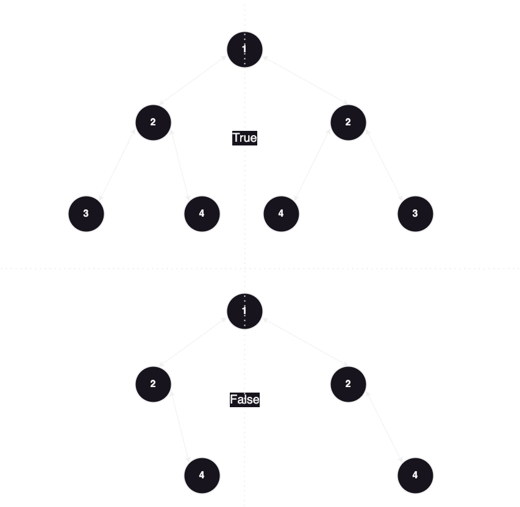
#### A) We skip the root node for it doesn't affect what we are searching for
#### B) Add left and rigth of the root node to the queue
#### C) while the queue is not empty we poll the last two elments in the queue and make these checks on them 
```java
if(left == null && right == null){
            continue;
        }
        if(left == null || right == null){
            return false;
        }
        if(left.val != right.val){
            return false;
        }
```
#### D)we add next elements to the queue by this order:
##### 1 l.l
##### 2 r.r
##### 3 l.r
##### 4 r.l
#### to have each item and the item i want to compare with behind each others in the stack and compare them in a correct way.
```java
/**
 * Definition for a binary tree node. 
 * public class TreeNode {
 *     int val;
 *     TreeNode left;
 *     TreeNode right;
 *     TreeNode() {}
 *     TreeNode(int val) { this.val = val; }
 *     TreeNode(int val, TreeNode left, TreeNode right) {
 *         this.val = val;
 *         this.left = left;
 *         this.right = right;
 *     }
 * }
 */
class Solution {
    public boolean isSymmetric(TreeNode root) {
        Queue<TreeNode> queue = new LinkedList<>();
        queue.add(root.left);
        queue.add(root.right);
        while(!queue.isEmpty()){
        TreeNode left = queue.poll();
        TreeNode right = queue.poll();
        if(left == null && right == null){
            continue;
        }
        if(left == null || right == null){
            return false;
        }
        if(left.val != right.val){
            return false;
        }
        queue.offer(left.left);
        queue.offer(right.right);
        queue.offer(left.right);
        queue.offer(right.left);
        }
        return true;
    }
}
```
#
#
## 2)DFS Problems
#
### 543 Diameter of a binary tree 
### The diameter of a binary tree is the length of the longest path between any two nodes in a tree. This path may or may not pass through the root.
### Example

### Input: root = [1,2,3,4,5]
### Output: 3
### Explanation: 3 is the length of the path [4,2,1,3] or [5,2,1,3].

#### Solution:
#### Diameter of every Node you pass by is LeftHeight + rightHeight + 1
#### we pass by all nodes to get all diameters in post order traversal
#### so in every node we pass by we compare it's diameter with the value saved in diameter if it's greater we save it 
#### in the end the value of the diameter will be greater than the answer we need by one for we need the path not the number of nodes se we return diameter - 1
```java
/**
 * Definition for a binary tree node.
 * public class TreeNode {
 *     int val;
 *     TreeNode left;
 *     TreeNode right;
 *     TreeNode() {}
 *     TreeNode(int val) { this.val = val; }
 *     TreeNode(int val, TreeNode left, TreeNode right) {
 *         this.val = val;
 *         this.left = left;
 *         this.right = right;
 *     }
 * }
 */
class Solution {
    int diameter = 0;
    public int diameterOfBinaryTree(TreeNode root) {
        height(root);
        return diameter-1;
    }
    int height(TreeNode root){
        if(root == null){
            return 0;
        }
        int leftHeight = height(root.left);
        int rightHeight = height(root.right);

        int dia = leftHeight + rightHeight +1;
        diameter = Math.max(diameter , dia);
        
        return Math.max(leftHeight, rightHeight)+1;
    }
}
```
#
### 226. Invert Binary Tree
### Given the root of a binary tree, invert the tree, and return its root.
### Example
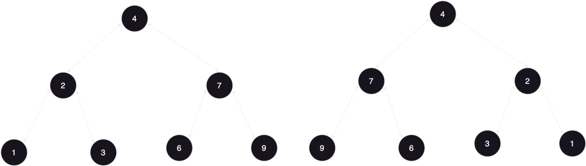
### Input: root = [4,2,7,1,3,6,9]
### Output: [4,7,2,9,6,3,1]
#### Solution:
#### save left in a variable left then make node.left = node.right and node.right the left variable we saved
#### make recursive calls for root.left and root.right
```java
/**
 * Definition for a binary tree node.
 * public class TreeNode {
 *     int val;
 *     TreeNode left;
 *     TreeNode right;
 *     TreeNode() {}
 *     TreeNode(int val) { this.val = val; }
 *     TreeNode(int val, TreeNode left, TreeNode right) {
 *         this.val = val;
 *         this.left = left;
 *         this.right = right;
 *     }
 * }
 */
class Solution {
    public TreeNode invertTree(TreeNode root) {
        if(root ==null){
            return root;
        }
        TreeNode left = root.left;
        root.left = root.right;
        root.right = left;
        invertTree(root.left);
        invertTree(root.right);
        return root;
    }
}
```
#### kunal's approach was to make it in post order traversal :
```java
/**
 * Definition for a binary tree node.
 * public class TreeNode {
 *     int val;
 *     TreeNode left;
 *     TreeNode right;
 *     TreeNode() {}
 *     TreeNode(int val) { this.val = val; }
 *     TreeNode(int val, TreeNode left, TreeNode right) {
 *         this.val = val;
 *         this.left = left;
 *         this.right = right;
 *     }
 * }
 */
class Solution {
    public TreeNode invertTree(TreeNode root) {
        if(root ==null){
            return root;
        }
        TreeNode left = invertTree(root.left);
        TreeNode right = invertTree(root.right);

        root.left = right;
        root.right =left;
        return root;
    }
}
```
#
### 108. Convert Sorted Array to Binary Search Tree
### Given an integer array nums where the elements are sorted in ascending order, convert it to a height-balanced binary search tree.
### Example 1:
### Input: nums = [-10,-3,0,5,9]
### Output: [0,-3,9,-10,null,5]
### Explanation: [0,-10,5,null,-3,null,9] is also accepted
#### Solution:
#### we create a helper function to recurse from it and it takes start and end attributes
#### every lap we create a new node with mid value
#### and recurse on it's left and right like this : 
```java
root.left = helper(nums, start, mid - 1);
root.right = helper(nums, mid + 1, end);
```
#### in the end root will be returned
```java
/**
 * Definition for a binary tree node.
 * public class TreeNode {
 *     int val;
 *     TreeNode left;
 *     TreeNode right;
 *     TreeNode() {}
 *     TreeNode(int val) { this.val = val; }
 *     TreeNode(int val, TreeNode left, TreeNode right) {
 *         this.val = val;
 *         this.left = left;
 *         this.right = right;
 *     }
 * }
 */
class Solution {
    public TreeNode sortedArrayToBST(int[] nums) {
        return helper(nums,0,nums.length-1);
    }

    public TreeNode helper(int[] nums, int start, int end){
        if(start > end){
            return null;
        }
        int mid = (start + end) / 2;
        TreeNode root = new TreeNode(nums[mid]);
        root.left = helper(nums, start, mid - 1);
        root.right = helper(nums, mid + 1, end);

        return root;
    }
}
```
#
### 114. Flatten Binary Tree to Linked List
### Given the root of a binary tree, flatten the tree into a "linked list":
### The "linked list" should use the same TreeNode class where the right child pointer points to the next node in the list and the left child pointer is always null.
### The "linked list" should be in the same order as a pre-order traversal of the binary tree.
### Example
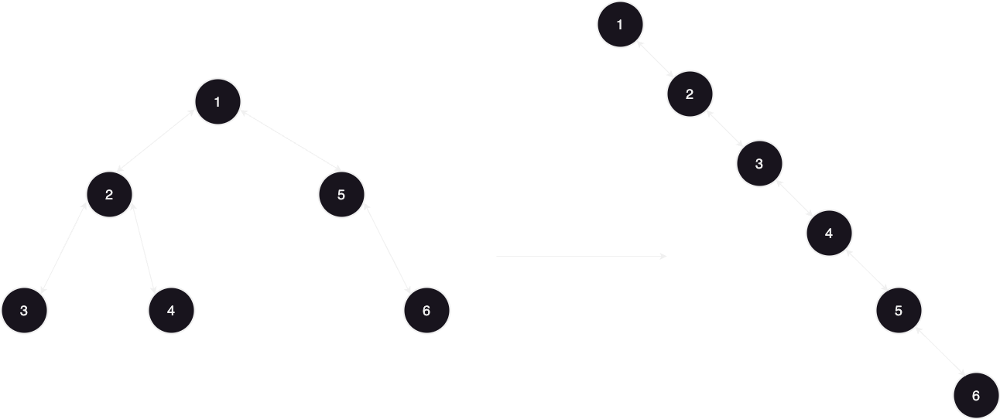
### Input: root = [1,2,5,3,4,null,6]
### Output: [1,null,2,null,3,null,4,null,5,null,6]
#### 1) Brute force approach:
#### make normal pre order traversal
#### as you traverse store nodes in a queue
#### in the end add items from the queue to make a linkedlist
#
#### 2) O(1) space complexity approach
#### Save the root node to current variable and move right with a while loop that runs untill cuurent is null
#### if current's left is not null save it in a variable called temp and move right untill temp.right = null and when you come out of this loop you will ena up at the right most element in the left part
#### do this when you come out: 
```java
temp.right = current.right;
current.right = current.left;
current.left = null;
```
#### so the left node with all the other nodes connected to it will move on the right side
```java
/**
 * Definition for a binary tree node.
 * public class TreeNode {
 *     int val;
 *     TreeNode left;
 *     TreeNode right;
 *     TreeNode() {}
 *     TreeNode(int val) { this.val = val; }
 *     TreeNode(int val, TreeNode left, TreeNode right) {
 *         this.val = val;
 *         this.left = left;
 *         this.right = right;
 *     }
 * }
 */
class Solution {
    public void flatten(TreeNode root) {
        TreeNode current = root;
        while(current != null){
            if(current.left != null){
                TreeNode temp = current.left;
                while(temp.right != null){
                    temp = temp.right;
                }
                temp.right = current.right;
                current.right = current.left;
                current.left = null;
            }
            current = current.right;
        }
    }
}
```
#
###
### 98. Validate Binary Search Tree
### Given the root of a binary tree, determine if it is a valid binary search tree (BST).
### A valid BST is defined as follows:
### The left subtree of a node contains only nodes with keys less than the node's key.
### The right subtree of a node contains only nodes with keys greater than the node's key.
### Both the left and right subtrees must also be binary search trees.
### Example 1:
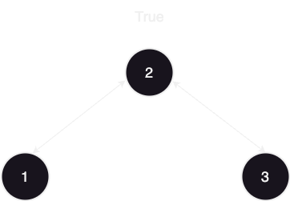
### Input: root = [2,1,3]
### Output: true
### Example 2:
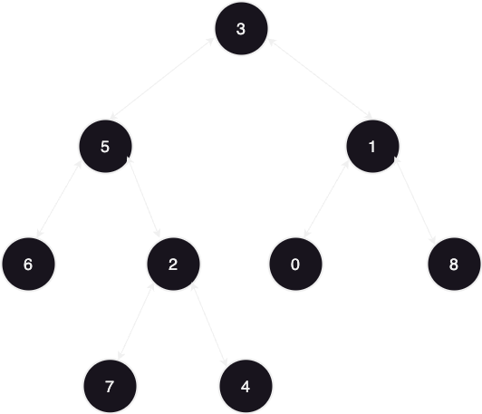
### Input: root = [5,1,4,null,null,3,6]
### Output: false
### Explanation: The root node's value is 5 but its right child's value is 4.
#### Solution:
#### Make a helper recursive function that takes the root, upper and lower limit values which are both initially null
#### check for the value of the current node to be greater than min and less than max
#### for the next left call max will be node.val and next right min will be node.val
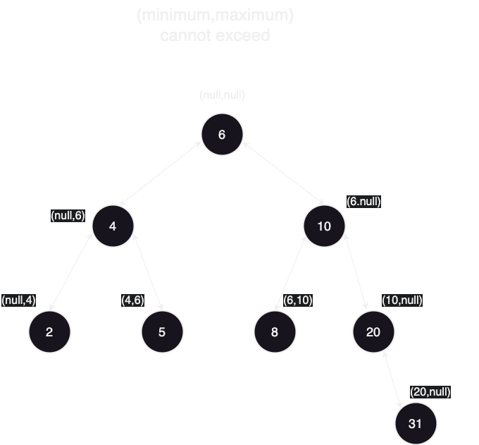
```java
/**
 * Definition for a binary tree node.
 * public class TreeNode {
 *     int val;
 *     TreeNode left;
 *     TreeNode right;
 *     TreeNode() {}
 *     TreeNode(int val) { this.val = val; }
 *     TreeNode(int val, TreeNode left, TreeNode right) {
 *         this.val = val;
 *         this.left = left;
 *         this.right = right;
 *     }
 * }
 */
class Solution {
    public boolean isValidBST(TreeNode root) {
        return helper(root,null,null);
    }

    public boolean helper(TreeNode node,Integer min,Integer max){
        if(node ==null){
            return true;
        }
        if(min != null && node.val <= min){
            return false;
        }
        if(max != null && node.val>= max){
            return false;
        }
        boolean left = helper(node.left,min,node.val);
        boolean right = helper(node.right,node.val,max);
        return left && right;
    }
}
```
#
### 236. Lowest Common Ancestor of a Binary Tree
### Given a binary tree, find the lowest common ancestor (LCA) of two given nodes in the tree.
### According to the definition of LCA on Wikipedia: “The lowest common ancestor is defined between two nodes p and q as the lowest node in T that has both p and q as descendants (where we allow a node to be a descendant of itself).”
### Example 1:

### Input: root = [3,5,1,6,2,0,8,null,null,7,4], p = 5, q = 1
### Output: 3
### Explanation: The LCA of nodes 5 and 1 is 3.
### Example 2:
### Input: root = [3,5,1,6,2,0,8,null,null,7,4], p = 5, q = 4
### Output: 5
### Explanation: The LCA of nodes 5 and 4 is 5, since a node can be a descendant of itself according to the LCA definition.
#### Solution:
#### if the two nodes were one under the other so no need to check below and the answer will be the above one.
#### so we make the function recirsive and check if root is null we return null and if the root is p or q we return root then recurse in left and right
#### in the and if left and right both are not null we return the root for it is the answer
#### if any of them is null we return the other one
```java
/**
 * Definition for a binary tree node.
 * public class TreeNode {
 *     int val;
 *     TreeNode left;
 *     TreeNode right;
 *     TreeNode(int x) { val = x; }
 * }
 */
class Solution {
    public TreeNode lowestCommonAncestor(TreeNode root, TreeNode p, TreeNode q) {
        if(root ==null){
            return null;
        }
        if(root == p || root == q){
            return root;
        }
        TreeNode left = lowestCommonAncestor(root.left,p,q);
        TreeNode right = lowestCommonAncestor(root.right,p,q);
        if(left != null && right != null){
            return root;
        }
        return left == null ? right : left;
    }
}
```
#
### 230. Kth Smallest Element in a BST
### Given the root of a binary search tree, and an integer k, return the kth smallest value (1-indexed) of all the values of the nodes in the tree.
### Example 1:
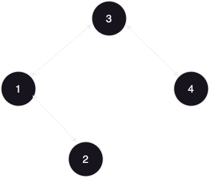
### Input: root = [3,1,4,null,2], k = 1
### Output: 1
### Example 2:
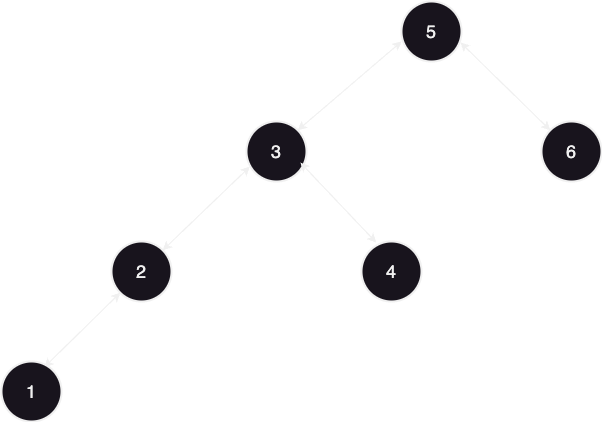
### Input: root = [5,3,6,2,4,null,null,1], k = 3
### Output: 3
#### Solution:
#### we make a helper function to recurse and return TreeNode and make the null check base case
#### we go left first then if left is not null return it to end the functionin this case
#### then we add an integer count outside the function and after passing by the last case only, we increment it 
#### when count reaches k we return the node we are at and if all these cases passed then the answer is on the rigth then recurse right
```java
/**
 * Definition for a binary tree node.
 * public class TreeNode {
 *     int val;
 *     TreeNode left;
 *     TreeNode right;
 *     TreeNode() {}
 *     TreeNode(int val) { this.val = val; }
 *     TreeNode(int val, TreeNode left, TreeNode right) {
 *         this.val = val;
 *         this.left = left;
 *         this.right = right;
 *     }
 * }
 */
class Solution {
    int count = 0;
    public int kthSmallest(TreeNode root, int k) {
       return helper(root,k).val;
    }
    public TreeNode helper(TreeNode root, int k){
         if(root == null){
            return null;
        }
        TreeNode left = helper(root.left,k);
        if (left!=null){
            return left;
        }
        count++;
        if(count == k){
            return root;
        }
        return helper(root.right,k);
    }
}
```
# 
### 105. Construct Binary Tree from Preorder and Inorder Traversal
### Given two integer arrays preorder and inorder where preorder is the preorder traversal of a binary tree and inorder is the inorder traversal of the same tree, construct and return the binary tree.
### Example 1:
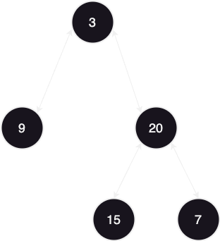
### Input: preorder = [3,9,20,15,7], inorder = [9,3,15,20,7]
### Output: [3,9,20,null,null,15,7]
### Example 2:
### Input: preorder = [-1], inorder = [-1]
### Output: [-1]
#### Solution:
#### the first item in the pre order traversal is the root node so we make index start it with zero and save the value of the first number in pre order in an int r
#### we make a for loop untill we find this item in the inorder list and then make the index this item for the left of it will always be on the left and items on the right of it will always be on the right
#### we then create a new node give it rhe tree that we have and make recursion calls for left and right with this logic
```java
 node.left = buildTree(Arrays.copyOfRange(preorder,1,index+1),Arrays.copyOfRange(preorder,0,index));
node.right = buildTree(Arrays.copyOfRange(preorder,index+1,preorder.length),Arrays.copyOfRange(inorder,index+1, inorder.length));
```
#### then we return the new node we created after recursion calls
```java
/**
 * Definition for a binary tree node.
 * public class TreeNode {
 *     int val;
 *     TreeNode left;
 *     TreeNode right;
 *     TreeNode() {}
 *     TreeNode(int val) { this.val = val; }
 *     TreeNode(int val, TreeNode left, TreeNode right) {
 *         this.val = val;
 *         this.left = left;
 *         this.right = right;
 *     }
 * }
 */
class Solution {
    public TreeNode buildTree(int[] preorder, int[] inorder) {
        if(preorder.length ==0){
            return null;
        }
        int r = preorder[0];
        int index = 0;
        for(int i =0;i<inorder.length; i++){
            if(inorder[i]==r){
                index = i;
            }
        }
        TreeNode node = new TreeNode(r);
        node.left = buildTree(Arrays.copyOfRange(preorder,1,index+1),Arrays.copyOfRange(preorder,0,index));
        node.right = buildTree(Arrays.copyOfRange(preorder,index+1,preorder.length),Arrays.copyOfRange(inorder,index+1, inorder.length));
        return node;
    }
}
```
#
### 112. Path Sum
### Given the root of a binary tree and an integer targetSum, return true if the tree has a root-to-leaf path such that adding up all the values along the path equals targetSum.
### A leaf is a node with no children.
### Example 1:
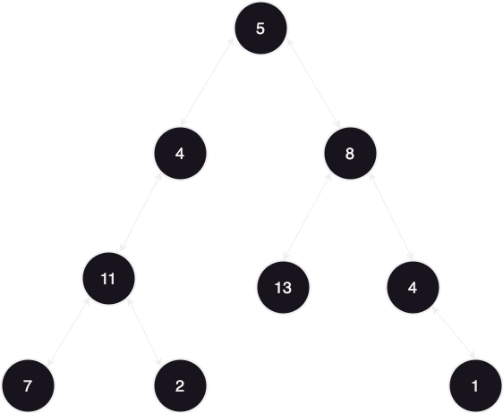
### Input: root = [5,4,8,11,null,13,4,7,2,null,null,null,1], targetSum = 22
### Output: true
### Explanation: The root-to-leaf path with the target sum is shown.
### Example 2:
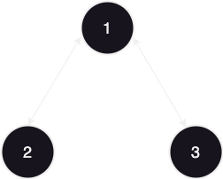
### Input: root = [1,2,3], targetSum = 5
### Output: false
### Explanation: There are two root-to-leaf paths in the tree:
### (1 --> 2): The sum is 3.
### (1 --> 3): The sum is 4.
### There is no root-to-leaf path with sum = 5.
### Example 3:
### Input: root = [], targetSum = 0
### Output: false
### Explanation: Since the tree is empty, there are no root-to-leaf paths.
#### Solution:
#### if the root is null return false (base case)
#### if you are in a leaf (left and right both are null) return weather target sum equals value of current node
#### return left or right recursuve calls and target sum in next calls will be decreased by cuurentnode.val
```java
/**
 * Definition for a binary tree node.
 * public class TreeNode {
 *     int val;
 *     TreeNode left;
 *     TreeNode right;
 *     TreeNode() {}
 *     TreeNode(int val) { this.val = val; }
 *     TreeNode(int val, TreeNode left, TreeNode right) {
 *         this.val = val;
 *         this.left = left;
 *         this.right = right;
 *     }
 * }
 */
class Solution {
    public boolean hasPathSum(TreeNode root, int targetSum) {
        if(root == null){
            return false;
        }
        if (root.left == null && root.right == null) {
            return targetSum == root.val;
        }
        return hasPathSum(root.left, targetSum - root.val) || hasPathSum(root.right, targetSum - root.val);
    }
}
```
#
### 129. Sum Root to Leaf Numbers
### You are given the root of a binary tree containing digits from 0 to 9 only.
### Each root-to-leaf path in the tree represents a number.
### For example, the root-to-leaf path 1 -> 2 -> 3 represents the number 123.
### Return the total sum of all root-to-leaf numbers. Test cases are generated so that the answer will fit in a 32-bit integer.
### A leaf node is a node with no children.
### Example 1:
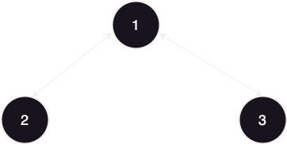
### Input: root = [1,2,3]
### Output: 25
### Explanation:
### The root-to-leaf path 1->2 represents the number 12.
### The root-to-leaf path 1->3 represents the number 13.
### Therefore, sum = 12 + 13 = 25.
### Example 2:
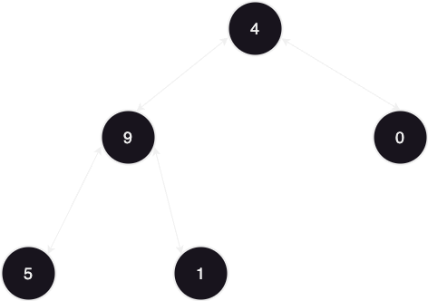
### Input: root = [4,9,0,5,1]
### Output: 1026
### Explanation:
### The root-to-leaf path 4->9->5 represents the number 495.
### The root-to-leaf path 4->9->1 represents the number 491.
### The root-to-leaf path 4->0 represents the number 40.
### Therefore, sum = 495 + 491 + 40 = 1026.
#### Solution:
#### make a helper function to maintain answer value
#### make the base case retruning 0
#### multiply answer by 10 and add current value to it
#### if you are on the leaf node return answer to prevent it from returning zero
#### recurse on left and right
```java
/**
 * Definition for a binary tree node.
 * public class TreeNode {
 * int val;
 * TreeNode left;
 * TreeNode right;
 * TreeNode() {}
 * TreeNode(int val) { this.val = val; }
 * TreeNode(int val, TreeNode left, TreeNode right) {
 * this.val = val;
 * this.left = left;
 * this.right = right;
 * }
 * }
 */
class Solution {
    public int sumNumbers(TreeNode root) {
        return helper(root,0);
    }

    public int helper(TreeNode root,int answer){
       if (root == null) {
            return 0;
        }       
        answer= (10 *answer) + root.val;  
        // to prevent it from returning 0 
        if(root.left == null && root.right == null){
            return answer;
        }   
        return helper(root.left,answer) + helper(root.right,answer);
    }
}
```
#
### 124. Binary Tree Maximum Path Sum
### A path in a binary tree is a sequence of nodes where each pair of adjacent nodes in the sequence has an edge connecting them. A node can only appear in the sequence at most once. Note that the path does not need to pass through the root.
### The path sum of a path is the sum of the node's values in the path.
### Given the root of a binary tree, return the maximum path sum of any non-empty path.
### Example 1:

### Input: root = [1,2,3]
### Output: 6
### Explanation: The optimal path is 2 -> 1 -> 3 with a path sum of 2 + 1 + 3 = 6.
### Example 2:
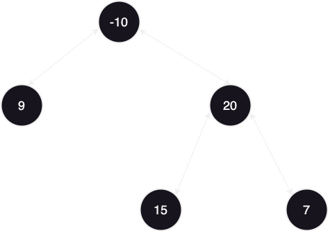
### Input: root = [-10,9,20,null,null,15,7]
### Output: 42
### Explanation: The optimal path is 15 -> 20 -> 7 with a path sum of 15 + 20 + 7 = 42.
#### Solution:
#### Make a global answer integer and set it to Integer.MIN_VALUE and make a helper function with base case returning zero
#### Make left and right recursion first and make sure they are both returning non-negative values 
#### make a current pathSum variable that is left + right + node.val and set the answer to whatever greater from answer or pathSum
#### return the greater item of left and right with root.val added to it
```java
/**
 * Definition for a binary tree node.
 * public class TreeNode {
 *     int val;
 *     TreeNode left;
 *     TreeNode right;
 *     TreeNode() {}
 *     TreeNode(int val) { this.val = val; }
 *     TreeNode(int val, TreeNode left, TreeNode right) {
 *         this.val = val;
 *         this.left = left;
 *         this.right = right;
 *     }
 * }
 */
class Solution {
    public int maxPathSum(TreeNode root) {
       helper(root);
       return answer;
    }
    int answer = Integer.MIN_VALUE;
    public int helper(TreeNode root){
        if(root ==null){
            return 0;
        }
        int left = helper(root.left);
        int right = helper(root.right);
        left = Math.max(0,left);
        right = Math.max(0,right);
        int pathSum = left +right + root.val;
        answer = Math.max(answer, pathSum);
        return Math.max(left,right)+root.val;
    }
}
```
#
### 110. Balanced Binary Tree
### Given a binary tree, determine if it is height-balanced
### Example 1:
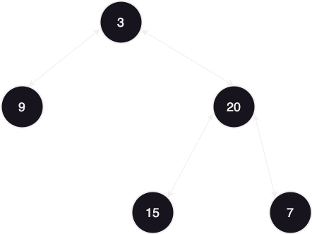
### Input: root = [3,9,20,null,null,15,7]
### Output: true
### Example 2:
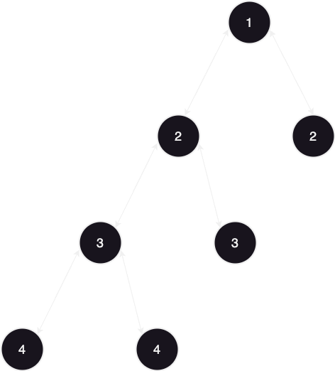
### Input: root = [1,2,2,3,3,null,null,4,4]
### Output: false
### Example 3:
### Input: root = []
### Output: true
#### Solution:
#### 1)my approach O(N^2):
#### in every node i check for it's height using helper function and then return false if any height of left exceeds right by more than one
```java
/**
 * Definition for a binary tree node.
 * public class TreeNode {
 *     int val;
 *     TreeNode left;
 *     TreeNode right;
 *     TreeNode() {}
 *     TreeNode(int val) { this.val = val; }
 *     TreeNode(int val, TreeNode left, TreeNode right) {
 *         this.val = val;
 *         this.left = left;
 *         this.right = right;
 *     }
 * }
 */
class Solution {
    public boolean isBalanced(TreeNode root) {
        if(root ==null){
            return true;
        }
        boolean left = isBalanced(root.left);
        boolean right = isBalanced(root.right);
        return left && right && (Math.abs(helper(root.left) - helper(root.right)) <=1);
    }
    public int helper(TreeNode node){
        if(node == null){
            return 0;
        }
        return Math.max(helper(node.left) , helper(node.right)) +1;
    }
}
```
#### 2) O(N) Solution:
#### Instead of making multiple calls to helper in each node, we can combine the balance check and height calculation in a single traversal. The idea is to traverse the tree once and calculate the height while checking if the tree is balanced.
```java
class Solution {
    public boolean isBalanced(TreeNode root) {
        // Perform a single DFS to check balance and calculate height
        return checkBalance(root) != -1;
    }
    
    // Helper function that returns the height of the tree if balanced, 
    // otherwise returns -1 if the tree is unbalanced
    public int checkBalance(TreeNode node) {
        if (node == null) {
            return 0;  // Base case: null node is balanced with height 0
        }
        
        // Recursively check left subtree
        int leftHeight = checkBalance(node.left);
        if (leftHeight == -1) return -1;  // If left subtree is unbalanced, return -1
        
        // Recursively check right subtree
        int rightHeight = checkBalance(node.right);
        if (rightHeight == -1) return -1;  // If right subtree is unbalanced, return -1
        
        // If the current node is unbalanced (difference in height > 1), return -1
        if (Math.abs(leftHeight - rightHeight) > 1) {
            return -1;
        }
        
        // Return the height of the current node
        return Math.max(leftHeight, rightHeight) + 1;
    }
}
```
#
### 111. Minimum Depth of Binary Tree
### Given a binary tree, find its minimum depth.
### The minimum depth is the number of nodes along the shortest path from the root node down to the nearest leaf node.
### Note: A leaf is a node with no children.
### Example 1:
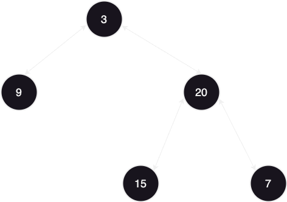
### Input: root = [3,9,20,null,null,15,7]
### Output: 2
### Example 2:
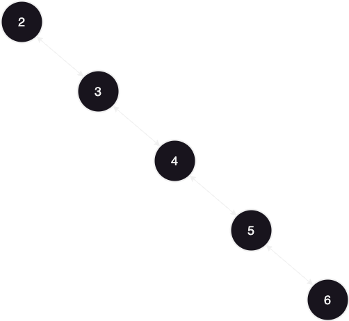
### Input: root = [2,null,3,null,4,null,5,null,6]
### Output: 5
#### My soluiton O(N^2):
#### in the main function i made a base case for if the root is null return zero and then return helper function that takes level starting from zero
#### in the helper function : if node is null return 1 ,if left and right is one then return level +1 , recurse left and right and the  call Math.min if Math.min is greater than 1 only to handle the case when there's no left tree, else make it Math.max
```java
/**
 * Definition for a binary tree node.
 * public class TreeNode {
 * int val;
 * TreeNode left;
 * TreeNode right;
 * TreeNode() {}
 * TreeNode(int val) { this.val = val; }
 * TreeNode(int val, TreeNode left, TreeNode right) {
 * this.val = val;
 * this.left = left;
 * this.right = right;
 * }
 * }
 */
class Solution {
    public int minDepth(TreeNode root) {
        if(root == null){
            return 0;
        }
        return helper(root, 0);
    }

    public int helper(TreeNode node, int level) {
        if (node == null) {
            return 1;
        }
        if (node.left == null && node.right == null) {
            return level + 1;
        }
        int left = helper(node.left, level + 1);
        int right = helper(node.right, level + 1);
        return Math.min(left, right)>1 ? Math.min(left, right): Math.max(left, right);
    }
}
```
#### A better O(N) solution: without using helper function make the base case return zero only if node is null, and if node.left is null return right recursion +1 and vice versa , if you passed the two conditions return Math.min of left recursion and right recursion +1 
```java
/**
 * Definition for a binary tree node.
 * public class TreeNode {
 * int val;
 * TreeNode left;
 * TreeNode right;
 * TreeNode() {}
 * TreeNode(int val) { this.val = val; }
 * TreeNode(int val, TreeNode left, TreeNode right) {
 * this.val = val;
 * this.left = left;
 * this.right = right;
 * }
 * }
 */
class Solution {
    public int minDepth(TreeNode root) {
        if (root == null) {
            return 0; // Base case: no tree, depth is 0
        }

        // If one of the subtrees is null, we need to consider the non-null subtree only
        if (root.left == null) {
            return minDepth(root.right) + 1;
        }
        if (root.right == null) {
            return minDepth(root.left) + 1;
        }

        // If both subtrees are non-null, calculate the min depth of both
        return Math.min(minDepth(root.left), minDepth(root.right)) + 1;
    }
}
```
#
### 257. Binary Tree Paths
### Given the root of a binary tree, return all root-to-leaf paths in any order.
### A leaf is a node with no children.
### Example 1:
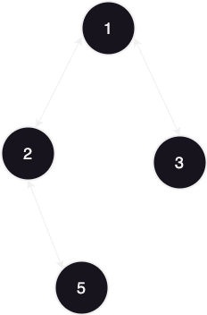
### Input: root = [1,2,3,null,5]
### Output: ["1->2->5","1->3"]
### Example 2:
### Input: root = [1]
### Output: ["1"]
#### Solution: 
#### initialize the answer array and call the void helper function if root is not null, the helper function takes the node,the answer array and string path
#### it starts with base case and then and then adds node.val to the path string, then if we are in a leaf node and the path to the list
#### else add this "->" and then recurse left and right
```java
/**
 * Definition for a binary tree node.
 * public class TreeNode {
 *     int val;
 *     TreeNode left;
 *     TreeNode right;
 *     TreeNode() {}
 *     TreeNode(int val) { this.val = val; }
 *     TreeNode(int val, TreeNode left, TreeNode right) {
 *         this.val = val;
 *         this.left = left;
 *         this.right = right;
 *     }
 * }
 */
class Solution {
    public List<String> binaryTreePaths(TreeNode root) {
        List<String> answer = new ArrayList<>();
        if (root != null) {
            helper(root, "", answer);
        }
        return answer;
    }

    private void helper(TreeNode node, String path, List<String> answer) {
        if (node == null) {
            return;
        }
        
        // Add the current node's value to the path
        path += node.val;
        
        // If it's a leaf node, finalize the path and add it to the answer
        if (node.left == null && node.right == null) {
            answer.add(path);
        } else {
            // If not a leaf, continue the path with "->"
            path += "->";
            helper(node.left, path, answer);
            helper(node.right, path, answer);
        }
    }
}
```
#
### 404. Sum of Left Leaves
### Given the root of a binary tree, return the sum of all left leaves.
### A leaf is a node with no children. A left leaf is a leaf that is the left child of another node.
### Example 1:
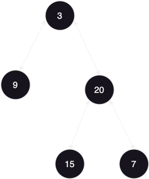
### Input: root = [3,9,20,null,null,15,7]
### Output: 24
### Explanation: There are two left leaves in the binary tree, with values 9 and 15 respectively.
### Example 2:
### Input: root = [1]
### Output: 0
#### Solution:
#### in the main function return zero if root is null, and make a helpr function that takes a boolean isLeft which starts with false
#### in the helper function return zero in the base case, recurse left with true and right with false
#### in the end return left and right and if isLeft is true and node.left and node.right is are both null (leaf node) add node.val, else add zero
```java
/**
 * Definition for a binary tree node.
 * public class TreeNode {
 *     int val;
 *     TreeNode left;
 *     TreeNode right;
 *     TreeNode() {}
 *     TreeNode(int val) { this.val = val; }
 *     TreeNode(int val, TreeNode left, TreeNode right) {
 *         this.val = val;
 *         this.left = left;
 *         this.right = right;
 *     }
 * }
 */
class Solution {
    public int sumOfLeftLeaves(TreeNode root) {
        if(root == null){
            return 0;
        }
        return helper(root,false);

    }
    private int helper(TreeNode root,boolean isLeft){
        if(root == null){
            return 0;
        }
        int left = helper(root.left,true);
        int right = helper(root.right,false);
        return right + left + (isLeft && root.left == null && root.right == null ? root.val : 0);
    }
}
```
#
### 530. Minimum Absolute Difference in BST
### Given the root of a Binary Search Tree (BST), return the minimum absolute difference between the values of any two different nodes in the tree.
### Example 1:
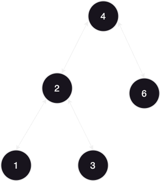
### Input: root = [4,2,6,1,3]
### Output: 1
### Example 2:

### Input: root = [1,0,48,null,null,12,49]
### Output: 1
### Constraints:
### The number of nodes in the tree is in the range [2, 104].
### 0 <= Node.val <= 105
#### Solution O(N):
#### make two global integers in the class prev which starts with null and minDiff which starts with max value
#### in the base case we will return mindiff, then make an inorder traversal with left first then if the previous is not null we set minDiff to the minimum of minDiff or root.val - prev , then set prev to root.val anyways and traverse to the right to complete the inorder traversal and return minDiff
```java
/**
 * Definition for a binary tree node.
 * public class TreeNode {
 *     int val;
 *     TreeNode left;
 *     TreeNode right;
 *     TreeNode() {}
 *     TreeNode(int val) { this.val = val; }
 *     TreeNode(int val, TreeNode left, TreeNode right) {
 *         this.val = val;
 *         this.left = left;
 *         this.right = right;
 *     }
 * }
 */
class Solution {
    Integer prev = null;
    int minDiff = Integer.MAX_VALUE;
    public int getMinimumDifference(TreeNode root) {
       if(root == null){
        return minDiff;
       }
       getMinimumDifference(root.left);
       if(prev!= null){
        minDiff = Math.min(minDiff,root.val- prev);
       }
       prev= root.val;
       getMinimumDifference(root.right);
       return minDiff;
    }
}
```
#
### 501. Find Mode in Binary Search Tree
### Given the root of a binary search tree (BST) with duplicates, return all the mode(s) (i.e., the most frequently occurred element) in it.
### If the tree has more than one mode, return them in any order.
### Assume a BST is defined as follows:
### The left subtree of a node contains only nodes with keys less than or equal to the node's key.
### The right subtree of a node contains only nodes with keys greater than or equal to the node's key.
### Both the left and right subtrees must also be binary search trees.
### Example 1:
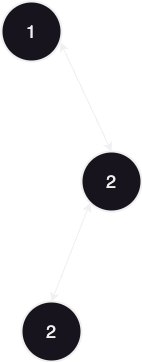
### Input: root = [1,null,2,2]
### Output: [2]
### Example 2:
### Input: root = [0]
### Output: [0]
### Constraints:
### The number of nodes in the tree is in the range [1, 104].
### -105 <= Node.val <= 105
#### Solution:
#### we make for global variables currentValue, maxValue, maxCount and answer arraylist, and in the main function we call helper function then convert the arrayList to an normal array and return it
#### in the void helper function we handle base case and then make the inorder traversal with a handleValue function in the middle that takes an integer val, with the following logic:
#### if val equals to the currentValue, increment currentCount , else set currentValue to val and currentCount to one, and if currentCount is greater than max count set maxCount to current count and clear the answer array and add val to it, if current count equals to max count just add currentCount to the answer array
```java
/**
 * Definition for a binary tree node.
 * public class TreeNode {
 *     int val;
 *     TreeNode left;
 *     TreeNode right;
 *     TreeNode() {}
 *     TreeNode(int val) { this.val = val; }
 *     TreeNode(int val, TreeNode left, TreeNode right) {
 *         this.val = val;
 *         this.left = left;
 *         this.right = right;
 *     }
 * }
 */
class Solution {
    private int currentValue;
    private int currentCount = 0;
    private int maxCount = 0;
    ArrayList<Integer> answer = new ArrayList<>();
    public int[] findMode(TreeNode root) {     
        helper(root);
        return answer.stream().mapToInt(i -> i).toArray();
    }

    private void helper(TreeNode node){
       if(node == null){
        return;
       }
       helper(node.left);
       handleValue(node.val);
       helper(node.right);
    }
    private void handleValue(int val) {
        if (val == currentValue) {
            currentCount++;
        } else {
            currentValue = val;
            currentCount = 1;
        }
        if (currentCount > maxCount) {
            maxCount = currentCount;
            answer.clear();
            answer.add(val);
        } else if (currentCount == maxCount) {
            answer.add(val);
        }
    }
}
```
 


